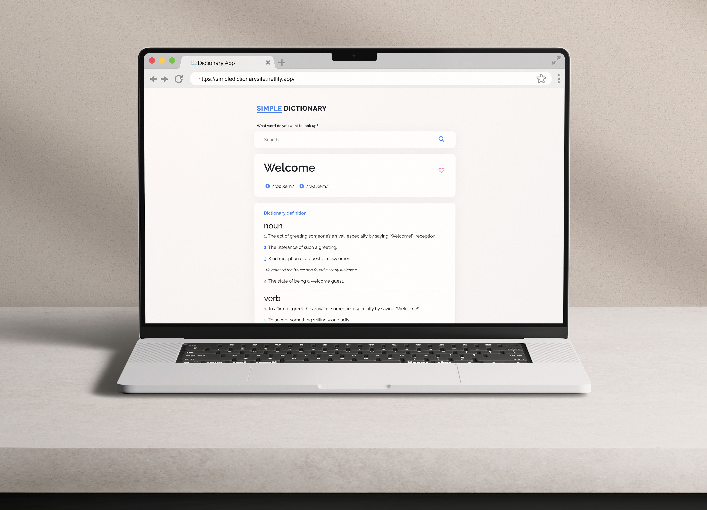

# Simple Dictionary App 📖

 

This application is designed to provide you with a straightforward and user-friendly way to explore and learn new words.

## Features 

- **Search Functionality**: Easily search for explain for any words.
- **Related Photos**: Related photos sourced from [Unsplash API](https://unsplash.com/).
- **Dictionary Api**: Dictionary sourced from [Dictionary API](https://www.dictionaryapi.dev/).

## Technologies / Tool Used 🛠
- React
- HTML & CSS
- Dictionary API
- Unsplash API
- Figma

## Try It Out 
To see the app in action, visit [Simple Dictionary App]([https://simpledictionarysite.netlify.app/]( https://simpledictionarysite.netlify.app/ ). 

## Getting Started 
1. Clone this repository: `git clone https://github.com/your-username/your-repo.git`
2. Install the required dependencies: `npm install`
3. Run the app locally: `npm start`

## Color Reference 🎨
| Color           | Hex      |
| --------------- | -------- |
| Dark Grey       |  #383838  |
| Sky Blue        | #4A80F0  |
| Pink            | #fa71cd  |
| white           | #ffffff  |

Feel free to explore and contribute to this project. If you have any suggestions or find issues, please create a GitHub issue. Thanks for visiting the Simple Dictionary App! 
